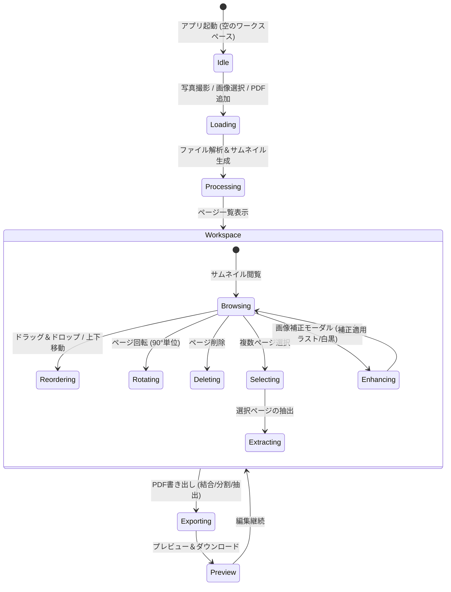

# システム設計書: スマート領収書・PDFスタジオ (Receipt & PDF Studio)

## 1. 技術選定と採用根拠 (Tech Stack & Rationale)
- **UI/フロントエンド**: HTML5, Modern CSS (Flexbox/Grid/CSS Variables), Vanilla JavaScript (ES6+)
  - **根拠**: KISS/YAGNI原則。過剰なNodeビルドツールや重厚なフレームワークを排し、単一フォルダまたはブラウザで即座に開いて動作する軽快さを実現。
- **PDF生成・編集エンジン**: `pdf-lib` (v1.17.1)
  - **根拠**: ブラウザ内での完全クライアントサイド実行が可能。PDFの新規作成、既存PDFの読み込み、ページの結合、削除、順序入れ替え、回転、抽出、JPEG/PNGの埋め込みを高精度かつ高速に処理可能。
- **PDFサムネイル・プレビューレンダラー**: `pdfjs-dist` (Mozilla PDF.js v3.11.174)
  - **根拠**: 既存PDFの各ページを `<canvas>` 上に高速レンダリングし、サムネイル一覧や詳細プレビューを高精細に表示可能。
- **画像処理エンジン**: HTML5 Canvas API (Pure Client-side Image Processing)
  - **根拠**: 撮影画像やアップロード画像に対するグレースケール変換、コントラスト補正（レシートスキャナー効果）、回転処理を外部ライブラリなしで超高速・安全に実行。

## 2. システム構成と状態遷移 (System & State Flow)



## 3. 画面構成・UI/UXレイアウト (Screen Design & Accessibility)
- **レスポンシブデザイン**:
  - モバイル (375px〜480px): 2カラムサムネイル、下部固定アクションバー、片手操作最適化。
  - タブレット・PC (768px以上): 3〜5カラムサムネイル、上部ツールバー＋サイド詳細設定。
- **アクセシビリティ & タッチターゲット (`mem_003_touch_target_44px`)**:
  - すべてのボタン、アイコンタップ領域、チェックボックスは **最小44px × 44px** を確保。
  - ドラッグハンドルや回転・削除アイコンは十分なタップマージンを付与し誤タップを防止。

## 4. データ構造・モデル (Data Structure / Types)

```javascript
// ページオブジェクト定義
interface PageItem {
  id: string;             // ユニークID (UUID/timestamp)
  sourceType: 'image' | 'pdf'; // 元データの種別
  sourceFile: File | null;
  pageIndex: number;      // 元PDFのページ番号 (1-indexed) または 1 (画像の場合)
  thumbnailUrl: string;   // DataURL (Canvas生成)
  rotation: number;       // 累積回転角度 (0, 90, 180, 270)
  width: number;          // 元サイズ 幅 (pt / px)
  height: number;         // 元サイズ 高さ (pt / px)
  aspectRatio: number;
  isSelected: boolean;    // 一括操作用チェック状態
  
  // 画像固有のプロパティ (sourceType === 'image')
  imageBlob?: Blob;       // 補正後画像Blob
  filters?: {
    mode: 'original' | 'bw' | 'contrast';
    brightness: number;   // -100 to 100
    contrast: number;     // -100 to 100
  };
  
  // PDF固有のプロパティ (sourceType === 'pdf')
  pdfBytes?: ArrayBuffer; // 元PDFバイナリ
}

// ドキュメント全体状態
interface StudioState {
  documentTitle: string;  // 出力ファイル名
  pages: PageItem[];      // ページ順序リスト
  selectedPageIds: Set<string>;
  activePageId: string | null;
  isProcessing: boolean;
  history: PageItem[][];  // Undo履歴 (簡易管理)
}
```

## 5. API / 主要関数シグネチャ (Interfaces & Signatures)

```javascript
// 1. ファイル取り込み
async function handleFiles(files: FileList | File[]): Promise<void>;
async function processImageFile(file: File): Promise<PageItem>;
async function processPdfFile(file: File): Promise<PageItem[]>;

// 2. ページ操作
function movePage(fromIndex: number, toIndex: number): void;
function rotatePage(pageId: string, angleDelta: number): void; // +90 or -90
function deletePage(pageId: string): void;
function toggleSelectPage(pageId: string): void;
function selectAllPages(selected: boolean): void;

// 3. 領収書画像補正
function applyImageFilter(canvas: HTMLCanvasElement, mode: string, brightness: number, contrast: number): ImageData;

// 4. PDF生成・結合・抽出・分割
async function exportFullPdf(): Promise<Uint8Array>;
async function extractSelectedPages(): Promise<Uint8Array>;
async function splitPdfAt(pageIndices: number[]): Promise<Uint8Array[]>;
```

## 6. 外部・ブラウザAPI連携仕様 (Browser APIs & Fallback)
1. **カメラAPI (`<input type="file" accept="image/*" capture="environment">`)**:
   - スマホ背面カメラを優先起動。
   - `capture` 属性非対応ブラウザ（PC等）では通常のファイル選択ダイアログがフォールバックとして自然に機能。
2. **HTML5 Drag and Drop API**:
   - PCでの直感的なPDF/画像ドラッグ＆ドロップ読み込み。
   - サムネイルカード間のドラッグ＆ドロップ並べ替え。
   - スマホ向けには各カードに「← 前へ」「次へ →」ボタンプラス長押しドラッグを併装。
3. **Canvas API**:
   - サムネイル縮小レンダリング、領収書二値化・コントラスト補正。

## 7. 認証・パーミッション管理 (Permissions & Security)
- 外部サーバー通信なし（オフライン動作）。
- カメラアクセスはHTML5標準ファイルピッカーを経由するため、特殊なブラウザ権限プロンプトの拒否によるクラッシュを完全回避。

## 8. エラー処理方針と例外ハンドリング (Error Handling Strategy)
- **非対応ファイル形式**: PDFまたは画像（JPEG/PNG/WebP/GIF）以外のファイルは通知アラートでスキップ。
- **破損したPDF**: PDF.jsでのパース失敗時は「破損したPDFまたは暗号化PDFです」と明示しクラッシュを防止。
- **大容量ファイル対策**: サムネイル生成時はCanvasサイズを制限（最大幅400px）してブラウザメモリを節約。

## 9. セキュリティ対策 (Security Considerations & XSS Prevention)
- **`mem_004_xss_prevention` 徹底**:
  - ファイル名、ページ番号、エラーメッセージのDOM描画はすべて `textContent` または `document.createTextNode` を使用。
  - `innerHTML` による動的文字列注入を完全排除。
- **プライバシー保護**:
  - 領収書や請求書のデータは一切サーバーへ送信せず、ブラウザ内メモリでのみ完結。

## 10. ファイル・ディレクトリ構成 (File Tree Structure)
```
receipt-pdf-studio/
├── index.html              # メイン画面HTML (SPA)
├── css/
│   └── style.css           # モバイルファースト・レスポンシブスタイル
├── js/
│   ├── app.js              # メインコントローラー・UIイベント
│   ├── pdf-engine.js       # pdf-lib / pdf.js によるPDF操作ロジック
│   ├── image-enhancer.js   # 領収書向け画像補正・Canvas処理
│   └── vendor/             # オフラインでも完全動作するライブラリ群
│       ├── pdf-lib.min.js
│       └── pdf.min.js + worker
├── docs/
│   ├── requirements/
│   │   └── receipt_pdf_app.md
│   └── architecture/
│       └── receipt_pdf_app.md
└── tests/
    └── test_runner.js      # 単体・結合テストスクリプト
```
